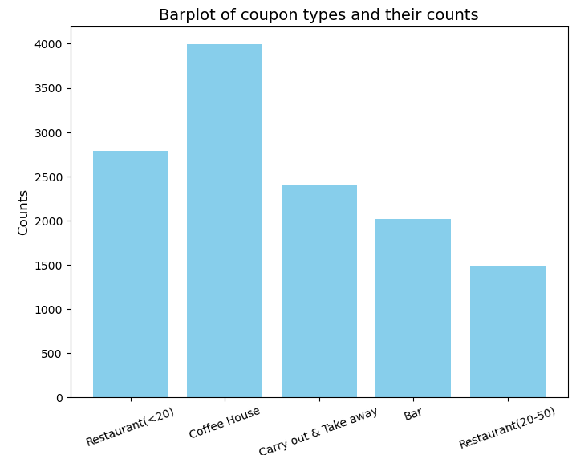

<html lang="en">
 <head>
 <meta charset="UTF-8" />
 <meta name="viewport" content="width=device-width, initial-scale=1.0" />
<h1>Jing Li's Online Portfolio</h1>
 <link
href="https://cdn.jsdelivr.net/npm/bootstrap@5.3.2/dist/css/bootstrap.min.css"
 rel="stylesheet"
 integrity="sha384-
T3c6CoIi6uLrA9TneNEoa7RxnatzjcDSCmG1MXxSR1GAsXEV/Dwwykc2MPK8M2HN"
 crossorigin="anonymous"
 />
      
 </head>
 <body>
  
 <!-- Navigation Bar starts here-->
<nav class="navbar navbar-expand-lg bg-body-tertiary">
  

    <a class="navbar-brand" href="#">Home</a>
    <button class="navbar-toggler" type="button" data-bs-toggle="collapse" data-bs-target="#navbarSupportedContent" aria-controls="navbarSupportedContent" aria-expanded="false" aria-label="Toggle navigation">
      
    </button>
    

      <ul class="navbar-nav me-auto mb-2 mb-lg-0">
        <li class="nav-item">
          <a class="nav-link" aria-current="page" href="###">My Journey</a>
        </li>
        <li class="nav-item">
         <a class="nav-link" href="###">Interests</a>
        </li>
        <li class="nav-item">
         <a class="nav-link" href="###">Education</a>
        </li>
      </ul>
      <form class="d-flex" role="search">
        <input class="form-control me-2" type="search" placeholder="Search" aria-label="Search">
        <button class="btn btn-outline-success" type="submit">Search</button>
      </form>
    

  

</nav>
<!-- Navigation bar ends here --> 

<!-- About me section starts here -->
   

        

            

                

                    
                       

                    

                        <h2>About Me</h2>
                        
Welcome to my portfolio. I'm Jing Li, a B2B product leader and strategist with 5 years at Amazon and 16+ years in supply chain/ logistics leadership. At Amazon, I improved ML/AI platforms, enhanced robotics performance, and optimized supply chain solutions, saving millions. In 2025, my mission is to help busiensses thrive in the era of agentic AI and industry digitization. I'll leverage Industry 4.0/IIOT concepts to build MES, UNS, SCADA, and agentic orchestration prototypes while completing my MIT/ UC Berkeley programs in coding and ML/AI. Check out my demos below and feel free to reach out with any questions. 
                        

                    
                    
                    

                

            

        

    

    

<!-- About me section ends here -->

<!-- Blog Posts Section Starts here, with added grid -->
    <section class="py-8">
        

            <h2 class="text-4xl font-bold mb-4 text-center">Demos</h2>
            
            <!-- Project Cards starts here -->
            

                

                    

                        
                        

                            <h5 class="card-title">Data-driven Insights on Coupon Acceptance</h5>
                            
Python, Data Analytics, Matplotlib, Seaborn, Pandas, Numpy, Plotly

                            <a href="https://github.com/jing-li528/couponDataAnalysis" class="btn btn-primary">Go to Repo</a>
                        

                    

                

                

                    

                        
                        

                            <h5 class="card-title">Demo#2</h5>
                            
Palceholder: demonstrated skills

                            <a href="#" class="btn btn-primary">Go to Repo</a>
                        

                    

                

                

                    

                        
                        

                            <h5 class="card-title">Demo#3</h5>
                            
Palceholder: demonstrated skills

                            <a href="#" class="btn btn-primary">Go to Repo</a>
                        

                    

                

                

                    

                        
                        

                            <h5 class="card-title">Demo#4</h5>
                            
Palceholder: demonstrated skills

                            <a href="#" class="btn btn-primary">Go to Repo</a>
                        

                    

                

                

                    

                        
                        

                            <h5 class="card-title">Demo#5</h5>
                            
Palceholder: demonstrated skills

                            <a href="#" class="btn btn-primary">Go to Repo</a>
                        

                    

                

                

                    

                        
                        

                            <h5 class="card-title">Demo#6</h5>
                            
Palceholder: demonstrated skills

                            <a href="#" class="btn btn-primary">Go to Repo</a>
                        

                    

                

            

            <!-- Project Cards ends here -->
        

    </section>
    <!-- Blog Posts Section ends here -->

    
</body>
</html>

